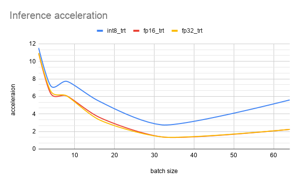

# Deployment of Object Detection Model for NVidia GPUs with use PyTorch & TensorRT


### Created by:

- [Alexey Gladyshev](https://github.com/KJlaccHoeUM9l)
- [Daniil Roman](https://github.com/DaniilRoman)


# 1. Overview

In this paper, IE TensorRT was researched to optimize machine
learning model inference for NVidia GPU platforms. 

The research of this tool was considered on the problem of object
detection using the
[SSD](https://github.com/NVIDIA/DeepLearningExamples/tree/master/PyTorch/Detection/SSD)
machine learning model. 

Experiments were conducted to evaluate the quality and performance
of the optimized models.

After that, the results were used in a demo application, which
consisted in writing a conditional prototype of a possible
implementation of a part of the emergency braking system.

For more details see [report](3rdparty/DL%20Huawei%20Contest%20Report%20(Gladyshev,%20Roman)%20v1.2.pdf).


# 2. General results

The graph below shows the performance of the model.
FPS is used as a metric. When the batch size is different from one,
the fps value is calculated as the ratio of the total time spent
processing the batch to the number of samples in this batch.
The table values represent the network bandwidth per second.

.png)

The previous graph operates with absolute performance values. 
But sometimes it can be helpful to look at the relative gain that comes from optimizing inference. Acceleration was considered relative to the speed values of the FP16 model, which used pure PyTorch to work.



It can be seen from the graphs that the greatest acceleration is
achieved at small batch sizes. When the size is equal to 
one - the maximum. This is especially useful for real-time
applications where data comes in sequentially and needs to be
processed immediately. It also allows you to run relatively
"heavy" models on various embedded modules
(nvidia jetson agx xavier, nvidia jetson nano)
so that they work out in a reasonable time.


# 3. Project structure
- `data` - directory that contains helper files for the project
- `src` - project source code
    - `models` - directory that contains the implementation of machine 
    learning models 
    - `utils` - some helper project functionality
    - `benchmarking.py` - script for comparative analysis of model
     prediction accuracy 
    - `conversion_tensorrt.py` - script for automatic model
     conversion from PyTorch to TensorRT 
    - `inference.py` - script that launches the demo application 
- `conf/config.yaml` - configuration file with launch parameters 

# 4. Usage
## 4.1. Demo application
To run the demo application, you need to change the following
parameters in the `config.yaml` file :
- `weights_path` - path to the weights of the trained model 
- `video_path` - the path to the video where the application will run 
- `use_fp16_mode` - (OPTIONAL) set to `false` if using` fp32` weights
- `use_tensorrt` - (OPTIONAL) set to `true` if using weights
converted for` TensorRT` 

Then enter the following command in the terminal:
```shell script
python src/inference.py
```

## 4.2. Benchmarking
To start benchmarking, you need to change the following parameters
in the `config.yaml` file: 
- `weights_path` - path to the weights of the trained model 
- `coco_data_path` - path to the directory where `COCO 2017 Dataset`
is located
- `use_fp16_mode` - (OPTIONAL) set to `false` if using` fp32` weights
- `use_tensorrt` - (OPTIONAL) set to `true` if using weights
converted for` TensorRT`
- `eval_batch_size` - (OPTIONAL) batch size

Then enter the following command in the terminal:
```shell script
python src/benchmarking.py
```

# 5. Setup

#### General dependencies
- PyTorch
- OpenCV
- TensorRT
- torch2trt

## 5.1 NVidia
To work, you need to install the following dependencies:
- СUDA version: 10.2
- Nvidia Driver Version: 440
- cuDNN version: 7.6.5
1) Install CUDA and Nvidia Driver using the `.deb` package.
To do this, follow the [instructions](https://developer.nvidia.com/cuda-10.2-download-archive?target_os=Linux&target_arch=x86_64&target_distro=Ubuntu&target_version=1604&target_type=deblocal).
2) Install cuDNN via `.tar` archive, for this you need to follow the [link](https://developer.nvidia.com/rdp/cudnn-archive).
Then select the desired version (`Download cuDNN v7.6.5 (November 18th, 2019),
for CUDA 10.2`), then download the `.tar` archive  (`cuDNN Library for Linux (x86)`).
3) Then follow the [instructions](https://docs.nvidia.com/deeplearning/cudnn/install-guide/index.html)
to install (tar file installation): 
```shell script
tar -xzvf cudnn-x.x-linux-x64-v8.x.x.x.tgz
sudo cp cuda/include/cudnn*.h /usr/local/cuda/include
sudo cp cuda/lib64/libcudnn* /usr/local/cuda/lib64
sudo chmod a+r /usr/local/cuda/include/cudnn*.h /usr/local/cuda/lib64/libcudnn*
```

## 5.2. Python
Anaconda was used to work. 
- First you need to create a new environment with `python 3.7`:
```shell script
conda create -n python37-cuda102 python=3.7 anaconda
conda activate python37-cuda102
```
- You need to install `pip` in the given environment: 
```shell script
conda install -n python37-cuda102 -c anaconda pip
```
- `PyCuda` needs to be installed: 
```shell script
pip install 'pycuda>=2019.1.1'
```
4) You need to install `ONNX parser`:
```shell script
pip install onnx==1.6.0
```
5) Next, install `PyTorch` (version> = 1.5.0) for the desired CUDA version. 

## 5.3. TensorRT
After all the steps above have been done, you can install 
`TensorRT` (version 6.1.0.8).
This must be done through the `.tar` file so that you can install
it in the `environment` created earlier by `anaconda`. 

To install, follow the [link](https://developer.nvidia.com/nvidia-tensorrt-6x-download).
Then download: TensorRT 6.0.1.8 GA for Ubuntu 16.04 and CUDA 10.2 tar package.
Then follow the [instructions](https://docs.nvidia.com/deeplearning/tensorrt/install-guide/index.html#installing-tar)
from the section `Tar File Installation`.

- It is necessary to unpack the archive into any convenient directory:
```shell script
tar xzvf TensorRT-7.2.1.6.Ubuntu-16.04.x86_64-gnu.cuda-10.2.cudnn8.0.tar.gz
``` 
- Export the absolute path to the terminal:
`<directory where the archive was unpacked>/TensorRT-6.0.1.8/lib`
- `cd TensorRT-${version}/python`
- `pip install tensorrt-6.0.1.8-cp37-none-linux_x86_64.whl`
- `cd TensorRT-${version}/uff`
- `pip install uff-0.6.9-py2.py3-none-any.whl`
- `cd TensorRT-${version}/graphsurgeon`
- `pip install graphsurgeon-0.4.5-py2.py3-none-any.whl`
- `cd TensorRT-${version}/onnx_graphsurgeon`
- `pip install onnx_graphsurgeon-0.2.6-py2.py3-none-any.whl`

After all the points have been done, enter the following command in the terminal: 
```shell script
python -c "import tensorrt as trt; print(trt.__version__)"
```
If everything went well, then a version of TensorRT should appear. 

## 5.4. torch2trt
After all the steps above have been done, install the converter in
anaconda environment: 

1) Clone: https://github.com/NVIDIA-AI-IOT/torch2trt
2) `python setup.py install --plugins`
